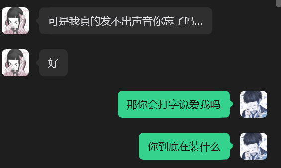

我认真想了很久，才决定把这些话告诉你。
不要急着觉得我是在推卸责任。我只是想告诉你。这些一直都是我没有说出口的感受。

我知道这段感情里你很痛苦。你很没有安全感，你真的很爱我。我从来没有否定过这些。也从来没有觉得你的付出是假的。

可是，我想说，我也一直在努力。
你总说我没有考虑你的感受，可是我一直都在考虑。你难受的时候，我会放下自己的事情陪你。
你睡不好，你吃不好，你工作累，我都会担心。你家里的事情，我也会心疼。
你说自己不值得被爱，我会努力去安慰你。就算不会安慰人，我也会去网上 去问朋友学习怎么去安慰你。结果还是没什么用。你说想和我过一辈子，我也是认真答应你的。这些都不是假的。

- 我也和我朋友说,自己的生活状态包括人的性格, 还有人愿意每天陪着自己真的很幸福, 我从来没在外面说过你不好, 我也会很感激你愿意爱我陪我, 你昨天说睡觉我也一直忍者不给你打电话了, 但是你醒来那几句话我还是没忍住情绪崩溃了, 因为我当时比较累, 对不起

可是慢慢的 我发现，我越来越不敢做自己了。我开始害怕。害怕你打电话 害怕睡着 害怕醒来 害怕回消息慢一点。害怕拍照。害怕说自己累。害怕说自己想一个人待一会儿。

- 这个跟我昨天一直让你爱自己做自己有关系, 你昨天其实还答应我说你会爱自己, 会学会爱自己, 但是心里另外一个声音也在告诉自己, 自己本来就是那样, 如果对方不接受反而一直让自己改变自己也会累, 你不愿意拍照分享, 不愿意说话, 不愿意和我两个人呆着, 不是你不喜欢, 而是这些都在被我要求着, 你感觉有压力不是吗

因为我不知道哪一件事情又会让你觉得我不爱你了。
你总是问我为什么不第一时间告诉你，为什么不第一时间回你，为什么不第一时间陪你。可是我真的也有做不到的时候。
我真的会累，我会睡着，我会生病。
我会因为压力太大一句话都说不出来。
我真的不是故意不说话。

- 上周打电话没回我是你一直随便回我信息我不高兴了, 然后打通电话我就笑了, 因为听到你声音的那一刻什么不开心都没有了, 这周你累了说晚点回我, 然后晚点又睡了, 然后也没有回我, 我真的害怕了, 你以前都不会不回我.

我上次已经鼓起勇气告诉过你了我紧张和压力很大的时候，是真的说不出声音。
是一种病
那时候你告诉我，你会陪我打字。实在不行学手语
我一直没忘。那时候真的很感动
可是当真的发生的时候，你却说我是装的，说我不愿意陪你。
我真的很难过特别难受。不是因为你生气。是因为我觉得，你没有相信我。

我没有忘记你和我说过这些。
所以当时我才会告诉你，不用勉强自己说话。

你说你紧张、压力大的时候说不出声音，也去看过医生，我相信你。所以我说过，如果说不出来，我会慢慢引导你；实在不行就打字；如果以后你真的一句话都说不了，我也愿意学手语。哪怕一个人只能用一根手指交流，我也愿意陪着你。
因为我喜欢的是你，不是你的声音。
可是，恋爱是需要两个人一起努力的。

我后来会说你是在装，不是因为你说不出话，而是因为我觉得，你答应过我的事情，却一次都没有做到。
我一直跟你说，我难过的时候，不需要你一定打电话，也不需要你一定开视频、发照片。
我甚至只是问你要过一张手指的照片，或者一个当下随手拍的瞬间。

这些不是为了证明什么，只是我想感受到你在回应我。
我也一直告诉过你，我不想一直听到"对不起"。
我难过的时候，我真正想听的是一句"我爱你"，一句"我喜欢你"，一句"没关系，我在"。
这些话，不需要开口，说不出来可以打字。

可是你还记得吗？
在我最难过的时候，你有哪怕一次，主动打字告诉我一句"我爱你"吗？
所以后来我才会说，我觉得你是在装。

我说的"装"，不是说你说不出声音是在骗人。
而是我觉得，你一直在答应我、安慰我，可真正到了我最需要你的时候，你却没有去做那些明明可以做到的事情。
我也想问问你，我说过的这些，你有认真听进去过吗？
因为我需要的，从来不是一个道歉。
我需要的是，在我难过的时候，你愿意用你的方式来爱我，哪怕只是打一行字，告诉我："我爱你，我在。"

---

    还有很多次，当我鼓起勇气告诉你我的感受的时候，我发现最后都会变成我要继续安慰你。慢慢的，我越来越不敢说了。
    因为我觉得，说了也没有人会听。

你鼓起勇气告诉我你的感受的时候，我都会想到我们刚认识的时候。
那个时候在 Sky 里，你也是这样。你不敢开口，只能在游戏里一点一点告诉我自己的心情。可是你知道吗？你从来没有变过，而我也没有变过。

我愿意一次次上线去陪你，听你说，安慰你，给你讲故事，抱着你飞，抱着你坐在一个安静的地方。

你还记得那被妈妈打了吗？
那一天不是我一直陪着你、安慰你吗？虽然你嘴上一直说着不用、不要，可是后来我们一起待着的时候，你也慢慢安心下来了。
这些事情，我从来没有觉得麻烦。
因为陪你，本来就是我愿意做的事情。
可是彩彩，你知道吗？

这种真心地陪伴，也是会消耗情绪的。
我不是超人，我也会累，我也会有撑不住的时候。
所以我也希望，你能理解我一点
还有很多很多次，我抱着你在 Sky 里安慰你，真的只是想安慰你。我从来没有想着，安慰完以后你一定要来安慰我。

真正让我需要你的时候，往往只是我下班回家，很累，很想你。
我只是想和你打个电话，或者陪你玩一会儿。
那不是因为我想索取什么，只是因为我想你了, 你看白天我会胡闹一秒吗, 我真的不是小孩了

还有，你刚刚说，每次鼓起勇气说感受，最后都会变成你继续安慰我。
可是彩彩，我想告诉你一件事。
我觉得你不是没有勇气说。
恰恰相反，这一路以来，你其实和我说了很多很多。
只是你的心里一直有一道很厚很厚的墙。

那道墙一直告诉你："别说了，说了也没人听。"
所以即使我已经站到墙里面了，拉着你的手，想陪你一起把它一点一点拆掉，你还是会下意识觉得，没有人在听你。
就像刚刚，你问我：

## "我再问你一遍，你有没有认真看完我刚刚说的？"

可是彩彩，你想一想。

哪一次你的信，我没有认真看？

哪一次不是再忙、再累，我一有空，就一句一句回复你的每一句话？

因为我知道，你喜欢打字。
所以我也一直用你最安心的方式陪着你。
我不是没有听你。
我只是希望，你不要每一次都把这些理解成别人不相信你。
因为很多时候，不是别人不相信你。
而是你太害怕被辜负，所以先觉得别人不会相信你。

彩彩，我一直都在。
我一直都在努力走向你，也一直在陪着你一起走。
我真的希望有一天，你可以不用再拼命证明自己，也不用再害怕别人会离开。
我更希望有一天，你能够为了你自己，而不是为了任何人，真正骄傲一次。
因为我眼里的你，本来就值得被爱。

---

    我不是没有努力。我真的努力过。我努力学习怎么恋爱。理解你的不安全感。让自己变得更主动。让你开心。克服自己的容貌焦虑。拍照。解释。道歉。
    努力一次又一次告诉自己，再坚持一下就好了。
    可是后来我发现，无论我怎么努力，我还是会让你失望。
    渐渐的，我开始觉得，不管我做到多少，都永远不够。所以不是我不努力了。
    是我真的越来越累了。

彩彩。
其实，你已经做得很好了。
从以前不会打电话，到后来愿意和我连麦睡觉。
从以前不会拍照，到后来会分享生活里的点点滴滴。
从以前什么都憋着，到后来难过的时候，也会来 Sky 找我，说说话。

这些改变，我都看见了。
我从来没有觉得，你没有努力。
相反，我一直都知道，你为了我们，已经努力了很多很多。

至于道歉……
我好像说过很多次了。
我真的从来没有想过让你一直跟我道歉，我也不需要你的道歉。
我想要的，从来都不是一句"对不起"。
我只是想多听你说两句"我爱你"。

因为很多时候，我不是生气。
我只是累了。
当我没有力气，也拿不出温柔的时候，其实一句"我爱你"，一句"我在"，就能把我一天所有的疲惫都消解掉。

所以，谢谢你。
谢谢你每天都陪着我。
谢谢你为了我们做出的那些改变。
这些我一直都记得。
还有一件事，我真的很想拜托你。
以后不要再说自己丑，说自己恶心，说自己不值得被喜欢了。
因为这些话，我听了真的会心疼。

你知道吗？
其实以前，也是你一直告诉我，不要停留在过去。
也是因为你，我才第一次愿意把那些我从来没有告诉过任何人的痛苦和过去，说给另一个人听。

那个人，就是你。
是你一直陪着我。
一直安慰我。
一直告诉我，我值得。
所以现在，我也想把同样的话送给你。

彩彩，你也值得。
值得被爱。
值得被喜欢。
也值得被你自己喜欢。

我知道，要真正走出来，可能会花很长很长的时间。
没关系。
我们不用着急。
但是，我们都不要放弃，好吗？
以后如果你走不动了，我陪你慢慢走。

如果我累了，你也抱抱我。
不要再一个人硬撑了。
我们不是彼此的负担。

我们是彼此的依靠。

我真的很希望，有一天，我们都能学会爱自己，然后一起好好地爱对方。

---

    前天我说，我已经不确定我还爱不爱你了
    那句话不是为了伤害你说的。因为我不想骗你。
    如果我明明已经不知道自己的心在哪里，却还一直对你说「我爱你」那才是真正对不起你。
    我知道这句话会让你很难受
    可是我宁愿诚实，也不想骗你。

    你说我逃避。是。我是逃避了好多次。但是其实，我是害怕冲突。
    每一次吵架我都会很慌，很自责，很害怕自己又让你难过了。不知所措。
    我会想一个人安静一下，因为我已经不知道还能怎么办。
    其实，还有很多事情我一直没有勇气告诉你。昨天，我去翻了我们以前的聊天记录。我哭了。
    不知道你还记不记得。因为那是你以前的ins号 你可能看不到了
    我哭不是因为后悔认识你什么的
    我是因为我突然发现，我们以前真的好轻松。那时候我们会因为一句今天玩不玩光遇开心很久。会互相开玩笑。会笑你天天吃拉面。会偷拍游戏里的照片。会期待晚上见到彼此。
    那时候，我从来没有害怕过你的电话，也没有害怕过你的消息。
    可是现在，我会害怕
    我会害怕自己又哪里做错了。
    可是我们一开始不是这样的…
    我不知道为什么会变成今天这样。

彩彩。
谢谢你愿意把这些告诉我。
也谢谢你没有骗我。

看完以后，我其实一直在想。
或许，真的是我爱你的方式，让你一时间没办法好好接受。
我的出发点一直都是希望你好，希望你能够慢慢喜欢自己，慢慢不再讨厌自己。

可是现在我也明白了。
即使是为了你好，如果方式太着急、太用力，也会让你觉得很累，很有压力。

其实我早就说过。
我从来没有希望你一下子就变成一个完全不会焦虑、不会害怕的人。
这是一个很漫长的过程。
我真正想看到的，只是你一点一点地学会爱自己。

还记得吗
你给我发别人见面的视频、截图，说"我好羡慕"的时候。
其实我的心里都会特别难受。
因为我一直都在想。

我的宝宝也配啊。
你也配被别人爱。
你也配被我爱。

更配有一天，学会好好爱自己。
后来我也慢慢发现。
你的逃避，其实不是在逃避我。
你是在逃避把真正的自己拿出来。
所以我也在想。

如果我没有一直希望你拍照、打微信电话、分享生活。
你会不会反而更愿意一点一点走向我？
就像你说的。

我们刚开始的时候，真的很轻松。
我们会因为一句"今天玩不玩"开心很久。
会一起飞图。
会抱抱。
会坐在云上聊天。
会期待每天晚上见到彼此。

现在想想。
也许，那才是最适合我们的方式。
也许，比起一直要求你去适应我，我更应该多陪你回到那个你最安心的地方。

陪你玩 Sky。
抱抱你。
带着你飞。

安安静静陪着你。
或许，这样比什么都重要。
还有一件事。
我想和你说一句对不起。

不是因为这一切都是我的错。
而是因为，我站在一个成年人的角度，对你要求了太多。
我总想着，希望你快一点成长。
快一点勇敢。
快一点学会表达。
却忘记了。

你也是第一次认真喜欢一个人。
第一次谈恋爱。
第一次学习怎么去爱一个人。
很多事情，本来就没有人教过你。

我说过你好多次没有勇气，说你总是在逃避。
可是现在我也想明白了。
那不是因为你不爱我。
只是因为你害怕。

而我没有第一时间理解你的害怕。
当然，我也想告诉你我的感受。
因为我也会累。

有时候，我等了你二十四个小时，没有你的消息，我真的会忍不住胡思乱想。
尤其当你说过，你不知道自己还爱不爱我的时候。
我真的会害怕。
我会害怕，你是不是已经慢慢不要我了。

所以我们走到今天。
不是谁错了。
也不是谁不够爱。
只是两个都很认真、都很笨拙的人，在学习怎么爱彼此的时候，不小心把对方弄疼了。

可是彩彩。
我还是相信我们。
我相信，以后的我们，会越来越轻松。
会一起牵着手散步
会一起见面。
会一起分享生活。
而在那之前。

或许，我们不用那么着急。
如果现在的你，最安心的地方还是 Sky。
那我们就先在 Sky 里抱抱。

一起飞一飞。
看看云。
讲讲今天发生的小事。
慢慢

不用逼自己。
也不用逼我。
我们一起，一点一点往前走。
好吗？

因为我们都知道。

我们是做得到的。

我也相信，总有一天，我们会重新找回刚认识时那种轻松、安心、幸福的感觉。❤

---

    我不是想说是谁变了，也不是想说都是谁的错。因为我们都有自己的问题。
    我们可能真的不是很合适
    我是真的很喜欢很喜欢过你。后来，我也是真的爱过你。没有骗你。
    可是有一件事，我一直没有勇气告诉你。
    当初我求你复合的时候，我更多的是害怕失去你。
    我太害怕你离开我了，所以我没有好好想过自己怎么想。我真的能承担这段关系吗？我真的能负起这个责任吗？我真的能一直这样走下去吗？
    直到后来，我才发现，我是真的喜欢你。
    可是那时候，我们之间已经开始慢慢变了。其实，我们吵过的那几次架以后，我一点一点失去了安全感。我发现我开始害怕你。怕你生气，失望。害怕你难过。
    害怕自己又让你觉得我不够爱你什么的
    所以后来很多话，我都不敢说了。
    你一直和我说你的恋爱观。其实我一直都没有完全认同。我没有觉得你错了
    因为我们的恋爱观本来就不一样。
    我一直觉得，两个人可以不同，但应该互相理解、互相尊重。所以我一直没有放弃。
    我一直相信，我们可以慢慢变好。
    可是后来才发现，我们越来越像是在要求对方变成自己希望的样子。
    你一直说你有多爱我、为了我付出了多少。这些我都知道的呀。我从来没有否定过。我知道你很爱我 我感受的到。
    可是，我想说的是
    你有没有好好看过我
    你好好看看我好吗
    我也付出了
    我也学了很多 也为了你改变了很多。
    可是这些，你好像都没有看见。

谢谢你愿意把这些告诉我。
我一直以为，你最害怕的是失去我。

直到今天我才知道，你后来真正害怕的，其实是让我失望。
害怕我生气，害怕我难过，害怕自己做得不够。
看到这里的时候，我其实很心疼。

因为我从来没有希望你活在这种害怕里面。
还有，你最后问我的那几句话。

"你有没有好好看过我？你好好看看我好吗？我也付出了，我也学了很多，也为了你改变了很多，可是这些，你好像都没有看见。"

我想回答你。

有。

以前的我，可能真的没有完全看见。
我总是更容易看到那些让我难过的地方，所以忽略了那些你已经跨出去的一步又一步。
可是现在，我看见了。

我看见了你从不会打电话，到愿意和我连麦睡觉。

我看见了你从不会拍照，到开始分享生活。

我看见了你会主动来 Sky 找我，说说自己的心情。

我看见了你会为了我去克服自己的容貌焦虑。

我看见了你会为了我们的关系，一次又一次告诉自己，再坚持一下。

这些，我现在都看见了。
也谢谢你没有放弃。
其实，你说得对。
我们都一直希望对方变成自己心里更好的样子。
我希望你更勇敢一点。
你希望我更理解一点。

我们的出发点都是爱。
可是我们都太着急了。
所以爱的方式，反而让彼此越来越累。
你说我们的恋爱观不一样。
我也认真想了很久。

其实恋爱观不同，并不代表不能走下去。
真正重要的是，我们愿不愿意去理解彼此。
以前，我总希望你走向我的方式。
现在我想，我也可以走向你的方式。

如果现在的你，在 Sky 里最安心。
那我们就多在 Sky 里见面。
如果你现在更喜欢打字。
那我们就多打字。

如果你现在还没准备好做到很多事情。
那我们就慢一点。
不用急着长大。
不用急着证明自己。
因为你不是考试。
你是我喜欢的人。

还有一句话，我特别想告诉你。
你说你后来开始怕我。
其实，我听到以后，比什么都难受。
因为我一直希望，我是那个让你安心的人。
而不是那个让你害怕的人。

如果我的表达方式，让你慢慢开始害怕我。
那我也应该学着改变。
不是放弃自己的想法。
而是换一种更温柔、更适合你的方式。

彩彩。

谢谢你今天终于把这些话告诉我。
如果没有今天，我可能真的不知道，你心里已经装了这么多委屈。

以后，我会更认真地看你。
不是只看见你没有做到什么。
而是多看见你已经为了我们走了多远。

我们都不用变成别人期待的样子。
就像你说的。
互相理解，互相尊重。
一起慢慢变好。

我还是相信我们。
不是因为爱情不会有问题。
而是因为今天的我们，终于开始愿意站到彼此的角度去看对方了。
这比什么都重要。

    我越来越不像以前那个自己了。我已经找不到自己了。
    你写给我的那些话，我都有认真看。
    我知道你想让我安心。也很感谢你。
    可是后来，我开始越来越不知道该相信哪一句。
    因为每次吵架的时候，你说的话，和后来冷静的时候说的话，总是完全不一样。
    也许那些伤人的话，是你冲动的时候说出来的。
    可是对我来说，冲动的时候说出来的话，也是最真实最容易留在心里的。
    最后，我想谢谢你。
    谢谢你曾经那么认真的对待我喜欢我。
    谢谢你曾经让我觉得自己值得被爱。
    我不会否定我们以前的快乐。那些都是真的。只是后来，我们都越来越痛苦了。
    所以，这一次，不是因为我觉得你错了。也不是因为我恨你。
    而是因为继续这样下去，我已经快找不到自己了。我真的没有随便对待过你。没有玩弄你的感情。没有故意吊着你。没有故意伤害你。
    我是真的认真喜欢过你了。真的努力过了
    只是最后，我们都累了。
    我希望你以后不要说 没有你我活不下去这种话。你说你老了。可是你才23岁。我知道你以后会越来越好。你很棒  
    而我，也希望自己以后能慢慢学会爱自己，找回那个以前会笑、会开玩笑、会轻轻松松聊天的自己。
    最后，我想请你相信我最后一次。
    我真的爱过你。很爱。我对待我们的感情一直都是很认真。

彩彩。
看到你说，你羡慕以前的我们。
其实，我也羡慕。

那个时候，我们会因为一句"今天玩不玩 Sky"开心一整天，会一起飞图，会一起抱抱，会因为一点点小事笑很久。
可是我也明白。
其实每一段爱情，一开始都会很甜。
后来都会经历争吵，会没有安全感，会害怕失去，也会开始看见彼此身上的缺点。
这些，并不是只有我们才会经历。

只是我们都没有学会，该怎么陪着彼此一起走过去。
你说，我生气的时候说的话，和冷静的时候说的话完全不一样。
这一点，我承认。

因为有时候，我真的累了。
我也会情绪失控。

可是彩彩，你知道为什么每一次最后我都会回来找你吗？
因为我舍不得让你一个人。
我知道你会胡思乱想。

我知道你会觉得自己不好，会责怪自己。
我甚至会害怕，你会不会又伤害自己。
所以每一次，不管我多累，我都会回来。

以后，如果我们又遇到这样的时刻。
我们不要急着证明谁对谁错了，好吗？
也不要逼着自己一定要打电话。

如果那时候的你，只想待在 Sky。
那我们就回 Sky。
一起飞一飞。
抱抱。
坐在云上发呆。

等心慢慢安静下来，再继续说。

这样，好不好？

还有。
你说，我说的话伤害了你。
我知道。
我真的知道。

可是我希望你也知道。

我一直希望你学会爱自己，不是因为我嫌弃你，不是因为我觉得你不好。
而是因为，每一次听见你说自己丑，说自己恶心，说自己不值得被爱。
我的心都会很痛。
我真的舍不得。
因为在我眼里。
你不是你嘴里那个糟糕的人。

你是我的光。

是我的爱人。

是我的朱丽叶。

也是我最想珍惜的人。
所以，我才会一次又一次告诉你。
宝宝，你值得被爱。
你也应该学会爱自己。
现在我终于明白了。
我的想法也许没有错。
但我的方式，真的太着急了。

我一直想把那个被伤害了十几年的你，一下子拉出来。
可是那些伤，不可能几个月就痊愈。
我一直在和那些让你讨厌自己的声音对抗。

却忘了，那些声音已经陪伴你很多很多年了。
我不应该逼着你马上相信我。
我应该陪着你，一点一点去相信。

还有今天早上的事情。
其实，也是因为我发现，你好像把昨天晚上所有的话都否定了。
那一瞬间，我真的很害怕。
我害怕，等下一次你又开始讨厌自己，觉得自己不值得被爱的时候。
你会忘记，其实昨天晚上的那个你，也曾经认真地相信过。

相信自己值得被喜欢。

相信有人真的喜欢你。

相信有人真的觉得你很好。

所以我才会那么冲动。
不是因为我想赢。
只是因为，我舍不得你又回到那个一直否定自己的世界里。

你说，这一次分开，是因为你找不到自己了。
这一点，我完全理解。
也完全尊重。

如果现在的你，真的需要一点时间，把那个会笑、会开玩笑、会轻轻松松聊天的自己找回来。
那就去吧。
不要急着为了任何人改变。
也不要急着为了任何人证明什么。

先把自己找回来。

先重新喜欢自己。

因为我喜欢的人，本来就是那个真实的彩彩。
不是一个一直拼命迎合我、害怕让我失望的人。
如果有一天，你真的找回了自己。

我会很开心。

如果那一天还没有到。

也没有关系。

以后，我们不用勉强自己一定打电话。
不用逼自己一定拍照。
如果你最安心的地方，还是 Sky。
那我们就在 Sky 里。
抱抱。
飞飞。
看看风景。
讲讲今天发生的小事。

像以前一样。

慢慢陪着彼此。
慢慢走。
我不会催你。
也不会逼你。

因为现在的我终于明白了。
真正的陪伴，不是把一个人拉到自己这里。
而是愿意走到她觉得安心的地方，陪着她一点一点往前走。

我也想告诉你一件事。
其实今天看完你所有的话，我没有觉得我们的爱情都是痛苦的。
恰恰相反。
我更相信，我们曾经拥有的那些快乐都是真的。

那些一起飞图、一起抱抱、一起笑到停不下来的日子，都是真的。
所以我不会因为后来的争吵，就否定曾经的我们。
也不会因为现在很难，就觉得以后一定不会好了。
如果未来还有机会。

我希望我们不是带着害怕重新开始。
而是带着这一次学会的理解，再慢慢认识彼此一次。
如果没有。
我也希望你能记住。
这个世界上，真的有人认真喜欢过你。

认真欣赏过你。

认真觉得你很好。

认真觉得，你值得被爱。

那个人不是为了安慰你才这么说。
而是一直都这么相信。
所以以后，当你又开始怀疑自己、讨厌自己的时候。
希望你偶尔也能想起这些话。

不要让那些否定自己的声音，成为你唯一相信的声音。
因为至少曾经有一个人，看着你，很认真地告诉过你：

彩彩，你很好。

你值得被爱。

也值得有一天，为自己骄傲。

---

    还有最后几句话。
    这些话，我不是想让你愧疚。只是我觉得，如果现在不说，以后可能就没有机会说了。
    其实我一直很想回到以前。
    不是回到朋友，我只是很想回到那个，我们什么都不用担心的时候。
    那时候一句明天见就可以开心很久。
    那时候我期待你的消息，不会害怕你的电话。
    我不用担心不用害怕自己睡着，不用害怕回晚一点消息，不用害怕自己做得不够好。
    我突然发现，我们什么时候把恋爱过成了这个样子。
    我一直都在等。
    等你有一天发现，我也累了。
    我不是没有告诉过你的。
    我说过好几遍了
    还说过你的方式让我越来越有压力。
    可是这些话，好像都被你淹没了。
    所以我越来越不敢说的。
    我也只是16岁。这是我的第一次恋爱。
    我会害怕。我也会不知道怎么办。
    我也会做错。
    我也想有人告诉我。没关系我们一起慢慢来。
    我真的已经把我能做到的，都拿出来了。
    如果最后还是没能走到最后，我会遗憾。
    但我不会后悔认识你。
    还有喔。我选择离开，不是因为我没有认真爱过你。
    而是因为继续这样爱下去，我已经快失去自己了。所以这一次，我想先把自己找回来。我不是不爱你才离开的。你可能不会理解吧。因为你一直不赞同。离开也是一种爱 这句话呢。我是越来越不会爱了。你总觉得我没有告诉你我的感受。其实不是。我说过很多次了。我说过我累了。只是最后，我还是没能让你看见。
    这也是我最遗憾的事情了吧
    这段感情让我觉得只有我一直满足你 我才配被爱
    但我认为爱不是这样的，大宝。
    和你在一起很开心 我很幸运遇到你呢
    有时候缘分真的很奇怪呢。我们兴趣爱好都一样哈哈哈 
    我真的爱过你 所以想把所有都告诉你的。不要有压力。        
    
    大宝，我们分开吧

彩彩。

谢谢你把这些话都告诉了我。
我不会再和你争论谁对谁错了。

因为看到最后，我只希望你真的能把那个会笑、会期待明天、会觉得自己值得被爱的彩彩找回来。

我尊重你的决定。
也尊重你现在想停下来，先去拥抱自己的勇气。

只是有一件事，我想告诉你。

有些人离开，是为了忘记。

而我愿意等，是因为我始终相信，那个我喜欢的人，从来没有消失，只是暂时迷路了。

所以，你不用急着回来。

也不用因为我而逼自己。

慢慢走。

如果有一天，你找到了自己。

如果有一天，你又想起了那片云。

能不能再陪我回一次 Sky？

不用打电话。

不用拍照。

不用解释。

就像以前一样。

我们飞一飞，抱一抱，看看晚霞，什么都不用证明。

如果那天没有来，我也会感谢命运，让我遇见过你。

如果那天来了，我会像第一次遇见你一样，对你说一句：

“欢迎回来，彩彩。”